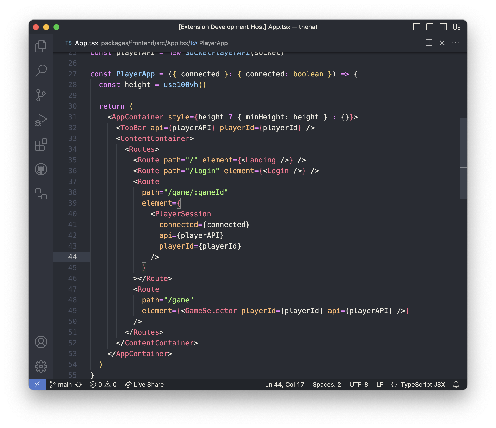
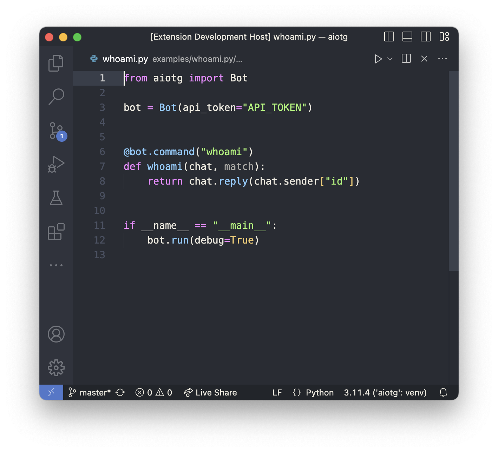

# One Dark Evo

Do you enjoy the aesthetics of One Dark but the redness of your JavaScript code makes your eyes bleed? Not to mention the low contrast.

Well, try One Dark Evo 😉

## Javascript

No more red all over your JavaScript and Functions are carefully colored to maintain visual hierarchy.

## Python

Dimmed docstrings, calm colors, minimal noise.

